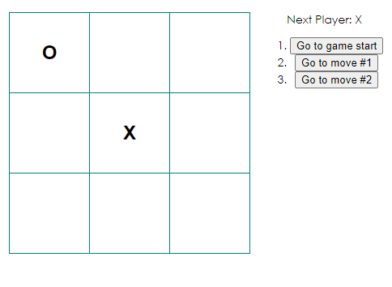
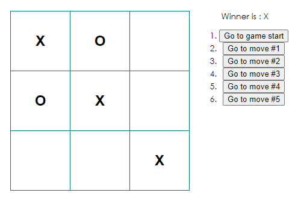

# Tic tac toe 

I created this game as a way to test my understanding of what
I learned from the [reactjs.org](https://reactjs.org/) website.

**Current game features**

- Let's you play tic-tac-toe
- Indicates when a player has won the game

- Stores a game's history as the game progresses
- Allows players to review a game's history and see previous versions of a game's board.

**Upcoming features**
1. Display the location for each move in the format (col, row) in the move history list.
2. Bold the currently selected item in the move list.
3. Rewrite Board to use two loops to make squares instead of hardcoding them.
4. Add a toggle button that lets you sort the moves in either ascending or descending order.
5. When someone wins, highlight the three squares that caused the win.
6. When no one wins, display a message about the result being a draw. 